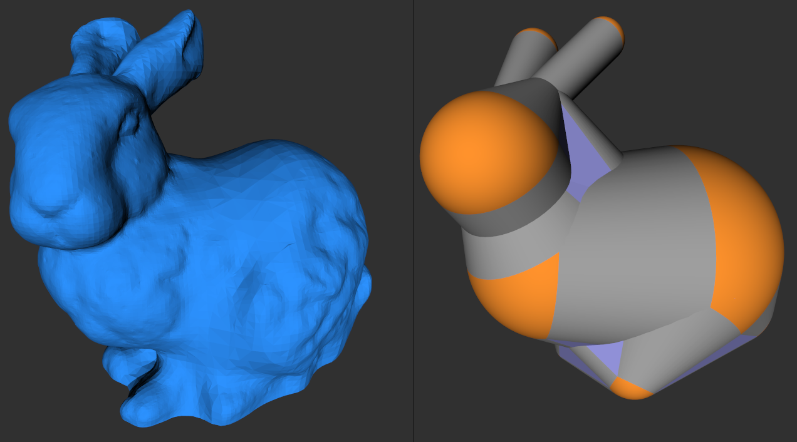

# Sphere Mesh Approximation
This is an implementation of the approximation algorithm proposed by *Thiery*, *Guy* and *Boubekeur* in their paper [Sphere-Meshes: Shape Approximation using Spherical Quadric Error Metrics](https://dl.acm.org/doi/10.1145/2508363.2508384). It uses the so called *Spherical Quadric Error Metric* to iteratively collapse edges of the mesh thus creating a simplified version of the original model.



## Requirements
- OpenGL 2.1 or higher
- the project uses the **C++ 11** standard
- [CMake](https://cmake.org/) for building
- [SDL2](http://www.libsdl.org/) library for creating window and OpenGL context

## Building
On linux simply run `make` from this folder.
This will **automatically** create a `build` folder from which cmake is run.

**NOTE**: This software has only been tested on linux (Ubuntu).
But if you install the necessary libraries it should also run on Windows (Visual Studio C++) or Mac.

## Usage
Basic usage:
```
./build/sphere_mesh -o <obj> -s <num_spheres>
```
For `<obj>` you can pass a 3D object file, for example `data/stanford_bunny.obj`.

The `-s <num_spheres>` argument specifies how many spheres you want to reduce the mesh to. The default is 20 spheres.

In the viewer hold the **left mouse button** to **rotate** the model. Hold the **right mouse button** to **move** the model. Use the **scroll wheel** to **zoom** in and out.
Use the key **A** to switch the display mode of the original mesh (left) and the key **D** to switch the display mode of the sphere mesh (right).

## Supported 3D-Model Files
Only wavefront `.obj` files are supported.
The mesh must be triangulated and should have normals. The file can contain UV coordinates but they will be discarded. If you're unsure, take a look at the example models in the `models/` folder.

## Commandline Arguments
Here is a list of all commandline arguments:
| **Argument** | **Description** | Default Value |
| - | - | - |
| `-o`, `--obj` `<file>` | Triangulated .obj model to load from file. | - |
| `-s`, `--spheres` `<integer>` | Number of spheres to reduce mesh to. | 20 |
| `-m`, `--msaa` `<integer>` | Number of samples for multisampled anti-aliasing e.g. 0, 2, 4, 8, 16. | 0 |
| `-f, --fullscreen` | Start window in fullscreen mode. | disabled |
| `-v`, `--vsync` | Enable Vertical Synchronization (V-Sync). | disabled |
| `--window-w` `<integer>` | Set window width in pixels | 800 |
| `--window-h` `<integer>` | Set window height in pixels | 400 |
| `-h`, `--help` | Show help. | - |
